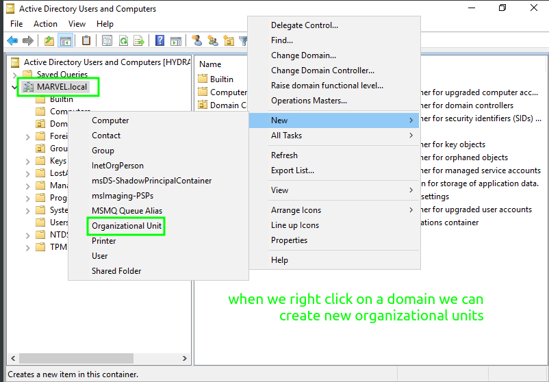

# Active Directory Introduction

Getting to know Active Directory is essential as it is used in organizations of all sizes and we will therefore be working with it.

AD is also often misconfigured and even low level users can enumerate an AD environment in the hunt for these misconfigurations which can ultimately lead to a complete pwning of a domain.

## High Level Overview

We will take a very high-level look at *domains* and *AD*

### Domains in Windows

Before we start digging into AD it makes sense to briefly consider what a *domain* is.

A domain in windows is a group of users and computers which are under the administration of a specific organisation.

Domains allow businesses to scale up and connect their machines and users on a larger scale.

The main idea of a domain is to centralise the administration of the various parts of a windows network.

With a domain, businesses can centralise identity management so all the users across the domain can be configured using Active Directory. Security policies can also be configured using Active Directoy and then pushed to users and computers across the domain as necessary. 

### High Level Overview of AD

The Active Directory Domain Service is the core of any domain in windows. It acts as a catalogue of all the objects in a domain. These objects come in many forms - they could be users, computers, printers, shared resources, policies and many other things.

AD essentialy lets us manage user *authentication* and *authorization* along with *resources* from a central point.

### Why Use Domains and AD?

The simple answer to this is because by doing so we make it much easier to manage resources such as computers, users, file shares, policies etc

If we imagine that we have a small business which has ten computers and about the same number of employees all working in one office it seems feasible that we could manage everything quite easily. We could set local users up on their machines and we could update the machines individually, too. It would be straightforward to tweak policies on the machines and install software machine by machine.

In such an situation we might choose not to use a domain and AD - but what if we need to manage a medium sized business which has several hundred computers and more than that employees based in several different offices?

Clearly, going around each machine in the different offices every time we want to run an update or change a policy is insane.

Now imagine a larger business which has thousands of machines and thousands of employees based in more than one country.

The need to use domains and therefore AD to manage them becomes clear when we consider such scenarios.

## Active Directory Fundamentals

In this section we will look at the basics of AD

### Active Directory Structure

AD is a service for network environments which use windows machines.

Its great strength is that it lets us manage resources along with authentication and authorization from a central point - this is essential when working with larger networks.

This leads to a very important point - AD is easily and often *misconfigured* - this is especially true when it is being used to manage large environments.

We mentioned earlier that a simple user on an AD environment can enumerate lots about the domain without needing extra privileges to do so. Some of the data which such a user can enumerate is:

- [x] Domain Users
- [x] Domain Computers
- [x] Domain Groups
- [x] Organizational Units
- [x] Domain Policies - Password Policies For Example
- [x] Group Policy Objects
- [x] Access Control Lists
- [x] Much More

With this in mind - let us start looking at the *structure* found in AD

The first point to note is that AD is *hierarchical* - it uses a *tree structure*

#### Domains

We will start with *domains*.

Domains are collections of objects which are logically grouped together. They provide a boundary when it comes to applying policies to objects and groups of objects.

It is within the domains that we find objects such as computers, users and groups.

Each domain has its own unique namespace.

To make this more clear we will use an example.

In our example we can imagine that we have created a company called TEZZLA - we started it in America and we created a domain for it called TEZZLA.COM

Over time our business grows and we start operating in Australia and China. We therefore create a domain for our Chinese operations and a different domain for our Australian operations.

This makes sense as there are differences with time-zones and languages - Australian is very hard to understand - so by creating domains we can let the domain admins in those countries manage things.

These new domains are *children* of the *parent* domain TEZZLA.COM

>[!NOTE]
>All the child domains in a tree share a namespace with the parent domain - this is an easy way to see that the domains are in a tree together

#### Trees

We are essentialy creating a *tree* which is the next container up in the AD structure. A *tree* is a collection of domains which have a parent - child relationship as in our example.

In our example we will create AU.TEZZLA.COM and CN.TEZZLA.COM

The lines in the diagram represent *trust relationships*

The default trust relationship in AD when a child domain is created is *two-way transitive* trust.

This means that the parent domain trusts the child domain and the child domain trusts the parent domain. This means that the users in TEZZLA.COM can access CN.TEZZLA.COM and users in CN.TEZZLA.COM can access TEZZLA.COM

Furthermore - because the trust relationship is *transitive* the *sibling domains* of CN.TEZZLA.COM and AU.TEZZLA.COM have a two-way trust as well.

>[!IMPORTANT]
>Just because users from AU.TEZZLA.COM can access CN.TEZZLA.COM domain this does not mean they can access every resource - the level of access to resources is still determined by permissions granted to the user accounts or the groups they belong to

#### Forests

Next we come to the top level container of an AD environment - the *forest*.

Forests are collections of domain trees.

>[!NOTE]
>Technically a forest and a tree are created when we create a domain - a very small forest and tree but a forest and tree nevertheless - mostly though we think of trees as being more than one domain and forests as more than one tree

Forests share a common schema, share a common configuration partition, share a common global catalogue to enable searches, enable trusts between all domains in the forest and share enterprise admins and schema admins.

>[!IMPORTANT]
>Enterprise admins are the *highest privileged* users in an AD forest - domain admins, schema admins and administrators are also privileged users but *enterprise admins* have a *forest wide* scope

The trees in a forest can have different namespaces - working with our example this could be a tree which uses TEZZLA.ORG as its root domain.

>[!NOTE]
>Each tree has a *root* domain - this is the first domain which is created in the namespace of the tree - the first domain in the first tree also serves as the *forest root* domain and has special significance

Hopefully the diagram below will start to make things more clear.

>[!NOTE]
>The diagram has had some arrows showing trusts left off because it would be cluttered - essentialy because there is a two-way transitive trust created between the trees in our forest *all* domains in TEZZLA.COM can access *all* domains in TEZZLA.ORG and vice-versa

The idea of having a transitive two way trust relationship established by default when trees are joined in a forest is that authentication and access to resources is easy across *all* the domains and child domains in the forest.

## Active Directory Objects

We find *classes* in the AD schema - the schema serves as a blueprint for AD

We can instantiate objects from these classes - this is similar to how we can instantiate objects from classes in Object Oriented Programing based languages such as python.

These objects are used by AD to represent network resources such as users and computers. They have *attributes* but not *methods*

The attributes vary according to the class the object has been instantiated from - a user object for example can have attributes such as *name* | *email* | *password* etc

In short - *any* resource we find in AD is actually an *object*

### User Objects

Since we are learning about AD and domains - the users we are refering to in this section are *domain users* which are different to *local user accounts*

Domain users are managed from a *domain controller* - a server which is essentialy the main brains in an AD environment.

Domain users can access resources across the entire domain - they can for example log into any machine which is joined to the domain.

When we refer to *user objects* in this section we are therefore referencing domain users.

User objects are very common in AD - they are also frequently targeted as pwning a user allows attackers to further enumerate AD and extend their attack.

In most organizations there will be *at least* one user account for each employee - some employees have more than one account for example IT staff who have an admin and standard account.

We will also find lots of *service accounts* and old accounts which are no longer activated - this means we will find many user accounts when we are working with organizations using AD

>[!IMPORTANT]
>Users are a weak link in any domain - they might use terrible passwords | share passwords | install dodgy apps | click on phishy links | other silly acts

User objects are one of the objects which are known as *security principals*.

Security principal objects such as users can be authenticated by the domain and given privileges over resources like files and printers in the domain.

We can see security principal objects as being able to act on resources in the network.

Since user objects are security principals they have a Security IDentifier and a Global Unique IDentifier.

User objects can have hundreds of attributes - but some are more common than others - common attributes include:

- Display Name
- Last Login Time
- Address
- Hundreds More

>[!NOTE]
>The UserPrincipalName attribute is the main logon name for a user account and conventionaly it will be the email address of the user

Some other important *attributes* of *user* objects are given below.

- ObjectGUID | this is a unique identifier and never changes
- SAMAccountName | a logon name which is used in authentication and authorization processes - it supports previous versions of Windows clients and servers
- objectSID | this is the Security IDentifier and is used in various interactions related to security
- sIDHistory | contains previous versions of SIDs - often found when user objects have migrated from domain to domain - once they have migrated they will have a new SID which becomes the objectSID whilst their previous SID goes to sIDHistory

Users can be people such as employees who need to access the network, but they can also be services such as IIS or MSSQL.

Every service needs a user to run, but *service users* are restricted to having only the privileges which they need in order to run their service.

Each user has a unique account which uses a username and a password to log into computers in domains and to then access network resources.

>[!NOTE]
>User objects are *leaf* objects which means they cannot contain other objects - they can be placed into other objects however such as *groups* and *organizational units*

#### Local Accounts

Even though we are looking at AD and domain users - it makes sense to get to know a little more about *local user* accounts.

These accounts are created on standalone machines and they can therefore not access resources across a domain.

The authentication for these accounts is handled by the local machine via the *Local Security Authority Subsystem Service*

LSASS takes the credentials entered by a user and hashes the plaintext password. It then interacts with the *Security Account Manager* database which is stored on the local machine at `\Windows\System32\Config\SAM` LSASS retrieves the stored password hash for the user and compares the input password hash with it - if they match the user is authenticated to the *local* machine.

LSASS will generate a *security token* for the authenticated user - this essentialy determines what they can do on the system via their SID | group memberships and privilege data.

Once the token has been created, it is attached to the users session.

>[!IMPORTANT]
>All of the authentication occurs on the *local* machine - no *domain controllers* are involved so *local user* accounts *cannot* access resources across a domain

##### Default Local User Accounts

We can create local user accounts but there are some default ones which are created automatically.

- Administrator | this account has full control over most of the *local* system and is the first account created - it has an SID of `S-1-5-21-<MACHINE-IDENTIFIER>-500`
- Guest | disabled by default and usually left disabled as it has a blank password and allowing anonymous access to a machine is not a great idea
- SYSTEM | this is the NT AUTHORITY\SYSTEM account - it is used by the operating system and many of its crucial services - it is the *most* privileged local account having more privileges than even an administrative user account - it is a *service* account and its SID is `S-1-5-18`
- Local Service | this account is used by services which only need low privileges
- Network Service | this account is similar to the *Local Service* account in that it has low privileges on the *local* system - it is used by services which need to interact with network resources

>[!TIP]
>The last part of an SID is called the *Relative IDentifier* - it makes each full SID unique - if we see it is `500` we know we are looking at the default *Administrator* account | standard local user accounts typically begin at `1001` and increment from there as they are created

### Computer Objects

Computer objects in AD are used for devices which join the domain. These machines can be clients or servers. In addition, these devices can either be physical or virtual machines.

Computer accounts are considered *security principals* as they can act on other resources in the domain. They have their own unique name and Global Unique IDentifier as well as a Security IDentifier.

Computer objects are *leaf* objects so they cannot contain other AD objects.

Since a secure trust relationship is established between a machine and a domain, computer objects can authenticate to other objects in the domain - such as other machines - and they can access network resources.

Computer objects can authorize users from the domain.

Each computer account has its own *security context* to operate across the domain - they do not have NT AUTHORITY\SYSTEM status on other machines within the domain.

The security context of the computer accounts can be altered by domain admins - for example they could allow a machine to access shared folders or printers.

>[!IMPORTANT]
>Even though computer accounts do not operate with elevated privileges on other machines in a domain - they are still *high value targets* because if we pwn one we will still have *read* access to lots of the domain and therefore will be able to *enumerate* AD to further our attacks

Having a machine joined to a domain rather than not being joined - a host not joined to a domain will be part of a *workgroup* - gives benefits.

When a machine is joined to a domain it can easily share and access resources. Policies can more easily and consistently applied via the domains *group policy*

If a machine is only part of a *workgroup* and not joined to a domain it is more difficult to share resources with other machines and changes to policies need to be performed on each machine locally.

>[!TIP]
>If we gain access to a domain via a computer account it is well worth our while to use it to enumerate the domain as well as loot locally stored data such as passwords, ssh keys and sensitive files - remember - a computer account in AD has pretty much the same rights as a domain user so it will have read access to lots of the domains data

### Group Objects

As the name suggests - *group objects* let us group together objects in AD

Group objects are therefore considered to be *container objects* as they can contain other objects including users, computers and other groups.

>[!NOTE]
>There are two different types of group in AD - we have *security groups* and *distribution groups* - distribution groups are used by email apps - we will focus here on *security groups* which are used for access, rights and privileges management

The main purpose of having group objects is so we can easily manage access to resources along with rights and privileges.

Consider a business which wants to give all one hundred members of their finance department access to a new shared folder - it would be crazy to do this on a one-by-one basis - this is where a group can help as the sysadmin could use an existing group or create a new one which contains the members of the finance department and then give that group access to the shared folder.

>[!NOTE]
>Groups are used for managing security related issues such as access | rights | privileges

#### Common Security Groups

We can create *custom* security groups in AD but there are also *builtin* security groups which are created when a domain itself is created.

Here are some of the builtin security groups.

##### Enterprise Admins

This is a group which has administrative privileges across an entire forest - this means that members of the enterprise admin group have admin privileges for *every* domain in the forest - obviously members of this group are high value targets.

##### Domain Admins

Members of this group have full admin conrol over the domain which the domain admin group was established for - also another high value target.

##### Server Operators

Members of this group have permissions to manage servers in the domain - these servers include *domain controllers* and therefore members of the server operators group are high value targets.

##### Backup Operators

Members of this group can backup *and* restore data on systems regardless of file permissions - they can also read and write to files due to their privilege to bypass file system permissions - clearly members of the backup operators group are also high value targets.

##### Account Operators

Members of this group can manage user, computer and group accounts. This means they can alter data relating to the accounts - for example reseting passwords | add new accounts | delete accounts - members of the account operators group are therefore considered high value targets.

##### Domain Controllers

Members of this group are high value targets because a *domain controller* is the main brain working within AD for a domain - they are servers which have been promoted to become domain controllers. Domain controllers are responsible for authenticating accounts, authorizing access attempts and maintaining the directory database.

##### Domain Users

Members of this group do not typically have high privileges but they are still very important as they serve as a great way to gain initial access to a domain. We can target domain users with techniques such as [phishing emails](https://github.com/puzz00/client-side-attacks/blob/main/client-side-attacks.md#phishing-campaigns-using-gophish) and once we have gained access via their account we can perform lots of useful enumeration of the entire domain. Since members of the domain users group are not considered as high a security risk as members of groups such as domain admins they typically are not monitored as closely and can therefore be easier to compromise.

##### Domain Computers

Members of this group are again very useful to gain an initial foothold with - we can do so via exploiting vulnerabilities or deploying malware. We can loot data from a compromised member of the domain computers group and they are also great for initial enumeration.

#### Nested Groups

Since group objects can - and frequently do - contain other group objects within them we can consider the security implications of this nesting of groups inside other groups.

Members of a group inherit privileges from the parent group or groups - this can easily lead to unintentional granting of privileges since keeping track of all the data can be tricky especially in large AD environments.

An excellent tool for enumerating misconfigurations of privileges resulting from nested group membership is *bloodhound* - this maps visually lots of useful data including group memberships and privileges relating to them. We will cover the use of bloodhound in more depth in another repo which we intend to use to go into more detail regarding the enumeration of AD environments.

#### Group Attributes

Group objects can have many attributes - here are some of the more common and useful ones to know about.

- cn | the *Common Name* attribute is simply the name of the group within AD
- member | the *member* attribute lets us find the members objects of the group
- groupType | this is an integer which lets us know the *group type* and the groups *scope*
- memberOf | this lets us check nested groups as we will see the names of groups which this group is in
- objectSID | the SecurityIDentifier is the unique value used to identify the group as a *security principal*

#### Group Scopes

We have already covered group types - security or distribution - we will now consider *group scope*

Within AD there are three scopes for groups to have.

- Domain Local Group
- Global Group
- Universal Group

We will look at these in more detail below.

##### Domain Local Group

Any groups which have the *domain local group* scope have the ability to manage permissions to resources *only* in the domain they were created in.

This means that members of a group which has the *domain local group* scope *cannot* manage permissions for resources in other domains which might be found in the AD environment.

Interestingly, groups with domain local scope *can* contain users from *different* domains. This means that a user object from domain B can get access to managing permissions for objects in domain A by being added to a security group which has domain local scope in domain A

There are other considerations to be taken into account when considering the above example - is there a bidirectional trust relationship between domain A and B for example - but it is technically possible.

>[!IMPORTANT]
>Domain local groups can be *nested* inside other *domain local groups* but they *cannot* be *nested* inside *global* scope groups

##### Global Scope

Group objects with *global scope* can operate across different domains. They *can* be nested inside *domain local* scope groups as well as other *global scope* groups.

Groups with *global scope* are limited to containing objects from the *same domain* as themselves.

##### Universal Scope

As the name suggests - group objects with *universal group scope* can contain objects from *any* domain in a forest.

They can contain group objects which have *universal* or *global* scopes.

>[!NOTE]
>Groups with universal scope are kept in the Global Catalog so altering objects in them causes replication to occur across a forest

### Organizational Unit Objects

When we log into a domain controller and manage active directory users and computers, we will see that the users, computers and groups are arranged into Organizional Units. These units can be seen as containers. It is common to see these units mirror the business logic of an organization - we might see units called sales, IT, admin etc.

>[!NOTE]
>Organizational units are different to security groups - security groups are used to manage privileges over resources whilst organizational units are used to apply policies quickly

The above note makes us aware that OUs are used to let administrators more easily manage domain objects.

Group Policy Objects - which we will cover later in these notes - can be attached to OUs and these GPOs will then affect the objects linked to the OU.

### Group Policy Objects

Group Policy Objects are objects in active directory which let us apply settings to organisational units. These settings can relate to users or computers. They can relate to security or other configurations and GPOs let us apply them quickly and easily to organisational units.

>[!NOTE]
>Hosts running windows have a *Local Group Policy* editor which can be used to manage *local* settings - we are focussing on *Group Policy* in a *domain* for use in *active directory*

GPOs are a great way to manage the security settings of users and computers in a domain since they can be easily and quickly deployed and they let us fine tune the settings. They can be abused however and if an attacker gains rights over a GPO they might be able to use it for lateral movement, priv esc or pwning the domain.

>[!NOTE]
>Attacks using GPOs often occur when an attacker compromises a user which has rights to modify a GPO which is attached to an OU which contains a user or computer which is under the control of the attacker

Group Policy Objects are essentialy a collection of policies. These policies can relate to many areas such as enforcing a password policy, managing screen lockout times, managing remote access settings and many, many more.

The policies can be applied to both users and computers in a domain. The GPO is attached to an Organizational Unit container and will apply to its members and child members if other OUs are inside it.

A GPO can be attached to any number of OUs and an OU can have any number of GPOs attached to it.

To make this more clear, here are some examples of how GPOs can be used:

- Prevent the use of external media such as USB drives
- Enforce password policies
- Block users from running certain types of file
- Enforcing logging
- Deploying new software across a domain

#### Practical Example of Group Policy Objects

To configure GPOs we can use the *Group Management Tool* which is available from the start menu in windows on a domain controller.

We need to first of all create a GPO under the GPO Organisational Unit in the OU hierarchy menu.

Once we have created a GPO, it will appear under the GPO OU and we can then attach it to other OUs.

>[!NOTE]
>It is worth keeping in mind that by default a GPO will apply to the OU we attach it to and *all* the child OUs of it

The following images demonstrate how to create a new GPO and attach it to OUs.

When we select a GPO, we will see what is inside it.

The first tab shows us its `scope` - which OUs it has been linked to.

We can set `Security Filtering` to the GPO - this means we can configure it so that it only applies to certain specific users or computers in the linked scopes.

By default, the security filtering is set to the `Authenticated Users` group which includes all the domain's users and computers.

The `Settings` tab lets us see the contents of the GPO.

We will see that there are computer and user configurations. For example, under computer configurations we might see security setting policies relating to minimum password lengths and thresholds for account lockouts.

We can edit the settings of a GPO by right clicking on it and selecting the *edit* option. We will then enter a new window which will let us navigate to all the available configurations.

>[!TIP]
>If we want to find out more about a specific policy within a GPO, we can double click it and navigate to the `Explain` tab

Group Policy Objects are distributed to the network via a network share called `SYSVOL` which is stored on a domain controller. All users in a domain should have access to this share so they can update their Group Policy Objects regularly.

The `SYSVOL` share points to `C:\Windows\SYSVOL\sysvol\` directory on each of the domain controllers for the network. It can take a couple of hours for all machines to catch up with new GPO settings.

>[!TIP]
>If we want to force a specific computer to update its GPO settings - we can use `gpudate /force` from a powershell session on the computer itself

## Active Directory Rights and Privileges

Rights and privileges are used in AD along with permissions as a major part of its security. There are differences between these terms.

- Permissions relate to what level of access users and systems have to objects such as files, directories and registry keys | examples of permissions are Read, Write, Modify and Full Control along with Execute for programs and List Folder Contents for directories
- Rights are the fundamental actions or operations a user can perform on a computer or network such as logging on, shutting down, changing the system time and backing up files or directories
- Privileges relate to what *specific* actions a user can perform which are not normally allowed for standard users such as debugging programs, loading device drivers and changing system configuration settings - we can see them as *special rights*

In short and simplified, we can see *permissions* as being rules relating to what users can do with files and directories | *rights* as being broad rules which determine what users can do with computers and *privileges* as being special rights which let users do more specific actions on computers.

### Built-In Security Groups

It is a common security vulnerability in AD environments that users have been given too many *rights* and or *privileges* and *permissions*

One way in which this can occur is via membership of built-in security groups which give their members powerful rights and privileges.

Access to the following groups needs to be very carefully managed since attackers who pwn users in them can use the rights and privileges granted by the group memberships.

#### Account Operators

Members of this group can create and modify most types of accounts including users, local groups and global groups

#### Administrators

On a local host members of this group have complete access to the machine - if a user is in this group on a *domain controller* they have complete access to the entire domain.

#### Backup Operators

Members of this group can back up and restore files and directories on local systems. They can also log onto domain controllers locally and create shadow copies of the Security Accounts Manager database and the NT Directory Services database. These are highly sensitive databases from which lots of confidential data can be looted if they are accessed.

>[!NOTE]
>The SAM database assists with managing users on local machines whilst the NTDS database manages and stores data relating to an active directory environment

#### DnsAdmins

Members of this group have access to DNS information for the network.

#### Domain Admins

A very powerful group - members have full administrative access to the *entire* domain - they are local admin on *all* domain joined machines.

#### Enterprise Admins

This is another very powerful group - members have administrative privileges across the entire *forest* - this includes *all* the domains in the forest.

#### Event Log Readers

Members of this group have *read* access to event logs on computers - this group is created when a host is promoted to be a domain controller.

>[!NOTE]
>Members of the *event log readers* group cannot modify, delete or clear event logs - being able to read them is a security risk in and of itself however so they need to be closely controlled and monitored

#### Print Operators

Members of this group can log onto domain controllers locally. This could be abused if an attacker pwns a user in this group and loads a malicious driver to elevate their privileges in the domain.

#### Remote Desktop Users

Members of this group can remotely access hosts via the Remote Desktop Protocol.

#### Server Operators

This group by default contains no members. It exists only on domain controllers and if a member is added to it they are able to modify services, access SMB shares and backup files on domain controllers.

### User Rights Assignment

>[!IMPORTANT]
>Whilst the term *Rights* is used in the name - in reality this concept refers to the assignment of *privileges* to users in that they determine what *special actions* users can perform

Users in a domain can have various *privileges* assigned to them via group memberships and Group Policy Objects. The concept of *User Rights Assignment* refers to this granting of different system level privileges.

Some example privileges which are sort out by attackers once they have gained a foothold in an active directory environment are given below.

- SeBackupPrivilege | a user with this privilege can create system backups - they can bypass file and directory Access Contol Lists and potentially therefore obtain copies of sensitive system files
- SeRestorePrivilege | as for the SeBackupPrivilege
- SeDebugPrivilege | a user with this privilege can adjust the memory of a process - in this way an attacker could use a tool such as *mimikatz* to read the memory space of the Local System Authority Subsystem Service and access credenitals stored there | they can also inject malicious code into running processes
- SeImpersonatePrivilege | a user with this privilege can impersonate the security context of a privileged account such as NT AUTHORITY\SYSTEM | this means they can access data which is restricted to the higher privileged user and perform administrative actions
- SeTakeOwnershipPrivilege | users with this privilege can take ownership of objects in the system - this means they can delete or modify files, directories or registry keys which they do not have explicit access to | attackers can abuse this privilege to modify security settings
- SeAssignPrimaryTokenPrivilege | a user can effectively use this privilege to take on the security context of another user - this is because they can replace the access token of a process with a different token | attackers can abuse this privilege to escalate their privileges by impersonating other users

It needs to be noted that whilst the above mentioned privileges are very useful for attackers in their post exploitation activities - they are not the only privileges which can cause security issues.

Unintended security vulnerabilities can be caused by the assignment of seemingly innocent privileges to users. An example of this would be if an attacker were to get *write access* to a GPO which applies to an OU which contains a user under their control - the attacker in this case would be able to assign privileges to the OU and therefore the pwned user via a tool such as [SharpGPOAbuse](https://github.com/FSecureLABS/SharpGPOAbuse)

In summary - attackers can and do take advantage of rights, privileges and permissions within AD environments to elevate their privileges, loot confidential data and gain persistence to compromised systems.

## Authentication

When using a domain in windows, all credentials are stored on a domain controller.

When a user wants to authenticate to a service, the service checks with the domain controller to see if the user has provided valid credentials.

NetNTLM used to be used and is still maintained for legacy support, but kerberos is the standard and default means of authentication used on a domain now.

### Kerberos

Kerberos is stateless and when it is used no credentials are passed across the network.

It is essentialy composed of three main steps - this is why it is named after the three-headed dog of Greek and Roman mythology.

>[!TIP]
>The kerberos authentication process uses port 88 to transmit data | we can therefore attempt to identify domain controllers by port scanning machines for port 88 being open

#### Kerberos Step One - Initial Authentication

The first thing a user needs is a *Ticket Granting Ticket* which can be issued by the *Key Distribution Center*

The KDC is a service on a domain controller.

The user sends their username along with a timestamp which has been encrypted using a key which has been derived from their password. This data is sent to the KDC which is in charge of creating tickets for kerberos on the domain.

The KDC will create a Ticket Granting Ticket along with a session key.

The TGT will be used by the user when they make requests for Ticket Granting Service tickets which are tickets to be used when attempting to access specific services on the domain.

The use of a TGT to get TGS tickets means that the user will never have to send their actual password across the network in any form.

The TGT includes a copy of the session key and it is encrypted using the hash for the *krbtgt* account. This means that the user will not be able to access what is inside the TGT.

The inclusion of a copy of the session key in the TGT means that the KDC does not need to keep copies of session keys - it can just obtain a copy of a session key by using its hash to decrypt a TGT if it needs to.

#### Kerberos Step Two - Ticket Granting Service Exchange

Once a user has got a valid TGT, they can use it when they make requests to access services.

To access a service on the domain, the user will send to the KDC their username along with their TGT, a timestamp which has been encrypted using the session key and a Service Principal Name which specifies a specific service. This request is for a Ticket Granting Service ticket which is a ticket which can be used by a user to access the specific service which the TGS ticket has been created for.

The KDC will send a response which consists of a TGS ticket along with a Service Session Key which is needed by the user in order to access the service. The TGS ticket is encrypted by the KDC using a key which has been derived from the service owner's password hash. The service owner is the user or machine account which the service is running under. The TGS contains a copy of the service session key so that the service owner account can access it by decrypting the TGS.

#### Kerberos Step Three - Client and Server Authentication Exchange

The TGS ticket is sent to the desired service along with the username and an encrypted timestamp. The service then uses the password hash of the account it is running under to decrypt the TGS and validate the service session key inside it.

If all of the above steps complete successfully, the user will be able to access the service which they want to access. The user's password has not been sent across the network at any point during the kerberos authentication process.

### NT LAN Manager

Whilst kerberos is the prefered way to authenticate - there are some occassions on which NTLM is still used.

Here are some examples of when we could find NTLM being used.

- Older legacy systems which do not support kerberos
- Machines not on the domain - kerberos needs machines to be on a domain in order to work
- Fallback mechanism - uses NTLM if there is a problem with kerberos
- File and print services - sometimes NTLM is used - especially in older environments or where linux machines are used along with windows machines

It is therefore still worth knowing about NTLM.

>[!IMPORTANT]
>NTLM is not as secure as kerberos | if we find it being used there are specific attacks we can carry out which will be covered in more detail in another repo

Essentialy, NTLM is a *challenge-response* method of authentication. The steps are as follows.

#### Step One - Negotiate

##### Client Request

The client machine sends a *negotiate* message to the server. This message indicates to the server the client machines capabilities and supported versions of NTLM.

##### Server Response

The server responds by sending a *challenge* to the client. This challenge message includes a randomly created value - number or string - which is called a *nonce*

>[!NOTE]
>A *nonce* in cryptography stands for *number used once* as it is a unique value

#### Step Two - Challenge

##### Client Response

The client machine responds to the challenge by sending an *authenticate* message which includes:

- The username
- The domain name
- The response to the challenge | this is an encrypted value created by using the *nonce* along with the users NTLM password hash

#### Step Three - Authenticate

##### Server Verification

The server forwards the challenge and response to a domain controller for verification.

The domain controller uses a copy of the clients hash to combine with the challenge.

It then checks its response with the response which the client provided to the server. If these two responses match, the DC will let the server know that it has been able to verify the clients credentials, otherwise it will let the server know that it has not been able to verify the clients credentials.

The server responds accordingly based on the result the DC has given it.

The above process is for netNTLM authentication on a domain. If the authentication is happening with a local account, the server can validate the clients response to the challenge itself as it will have a copy of the local account NTLM hashes stored in its SAM.
